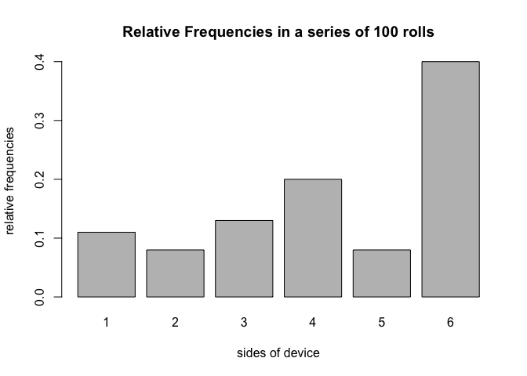

Report
================

Introduction
------------

"Roller" is an R package that is used for creating devices with programmable amounts of sides and probabilities, as well as rolling the devices and visualizing the frequencies of the rolls. It provides the following functions:

-   `device()` creates a device object (of class `"device"`).
-   `roll()` to roll a device object, creating a `"rolls"` object.
-   `plot()` method for a `"roll"` object to plot frequencies of a series of rolls.
-   `summary()` method for a `"roll"` object.s

1 Creating a `device`
---------------------

Create a `"device"` object with the function `device()` \* By default, `device()` creates a device with two sides (1, 2), and probabilties for each side corresponding to 0.5:

``` r
library(roller)
default_device <- device()
default_device
```

    ## object "device"
    ## 
    ##   side prob
    ## 1    1  0.5
    ## 2    2  0.5

If you want to change the sides or probabilities, you can do so by changing the default arguments `sides` and `prob`:

``` r
die <- device(sides = 1:6, prob = rep(1/6, 6))
die
```

    ## object "device"
    ## 
    ##   side      prob
    ## 1    1 0.1666667
    ## 2    2 0.1666667
    ## 3    3 0.1666667
    ## 4    4 0.1666667
    ## 5    5 0.1666667
    ## 6    6 0.1666667

You can easily created a loaded die like the following:

``` r
loaded_die <- device(sides = 1:6, prob = c(0.1, 0.1, 0.1, 0.1, 0.1, 0.5))
loaded_die
```

    ## object "device"
    ## 
    ##   side prob
    ## 1    1  0.1
    ## 2    2  0.1
    ## 3    3  0.1
    ## 4    4  0.1
    ## 5    5  0.1
    ## 6    6  0.5

Or a biased coin:

``` r
biased_coin <- device(sides = c(1,2), prob = c(0.3,0.7))
biased_coin
```

    ## object "device"
    ## 
    ##   side prob
    ## 1    1  0.3
    ## 2    2  0.7

Or a 75 sided die!

``` r
die_75 <- device(sides = 1:75, prob = rep(1/75, 75))
```

2 Rolling a device
------------------

After you have created your device object ready to be rolled, you will use the `roll()` function to do so. The `roll()` function takes in arguments `device` and `times`, in which you put in your created device and roll it the amount of `times` you want (by default set to 1).

``` r
flip_coin <- roll(biased_coin) # flip 1 time (default is 1)
flip_coin
```

    ## object "rolls"
    ## 
    ## [1] 2

When printed, the output shows the class and the vector of rolls:

``` r
roll10 <- roll(die, times = 10)
roll10
```

    ## object "rolls"
    ## 
    ##  [1] 6 2 3 6 3 4 3 6 5 2

Example - roll the loaded die 100 times:

``` r
loaded_roll100 <- roll(loaded_die, times = 100)
loaded_roll100
```

    ## object "rolls"
    ## 
    ##   [1] 6 3 6 3 6 4 4 4 3 5 6 4 6 5 6 3 2 6 1 3 4 6 6 5 3 6 5 6 6 6 6 4 4 6 6
    ##  [36] 1 4 1 4 3 6 6 6 3 6 1 1 2 6 6 6 1 2 4 6 4 6 1 4 6 2 3 2 4 4 1 6 6 2 3
    ##  [71] 6 6 4 4 4 5 2 6 3 6 1 3 4 5 6 6 6 6 4 6 5 6 3 1 1 6 2 6 5 4

You can easily check all the attributes of the roll device with the `summary()` function, easily displayed in a dataframe for convenience:

``` r
summary(loaded_roll100)
```

    ## summary "rolls"
    ## 
    ##   side count prop
    ## 1    1    11 0.11
    ## 2    2     8 0.08
    ## 3    3    13 0.13
    ## 4    4    20 0.20
    ## 5    5     8 0.08
    ## 6    6    40 0.40

Plot the Frequencies
--------------------

The function `plot()` can be used on the roll object to create a graphic representation of the relative frequencies. Here we can visualize the biasedness of the coin!

``` r
plot(loaded_roll100)
```


